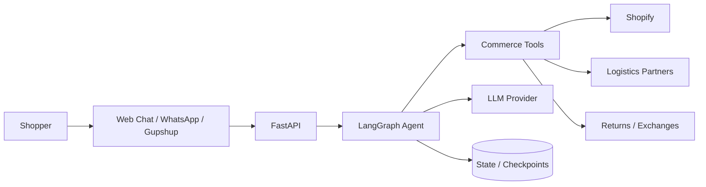

# EcommAgents — Ready-to-Run Open-Source AI Commerce Agent for Shopify

> **Run an AI commerce agent for your Shopify store. Clone it, configure your credentials, start it, and customize the existing agent for your own use case.**

**Shopify AI chatbot · Shopify AI agent · AI ecommerce agent · Shopify customer support chatbot · Shopify LangGraph · Shopify order tracking AI · Shopify returns exchange chatbot · Shopify WhatsApp chatbot**

EcommAgents is an **already-built, open-source AI commerce and customer-support agent** for Shopify. It combines **Shopify, LangGraph, FastAPI, LLMs, MCP/tooling, and conversational channels** so developers can run the existing system and adapt it instead of building an agent from scratch.

## 🚀 The idea

**Don't build an AI commerce agent from zero. Start with EcommAgents.**

Use the existing implementation for your store or application, then change the prompts, business rules, tools, integrations, UI, and workflows you need.

Typical use cases include:

- 🛍️ AI shopping assistant
- 🤖 Shopify customer-support chatbot
- 🔎 Product search and recommendations
- 📦 Order status and tracking
- ↩️ Returns and exchanges
- 💬 Website chat
- 📱 WhatsApp commerce/support
- 🧠 Stateful LangGraph agent workflows
- 🔧 Tool/MCP-powered commerce actions
- 🚚 Logistics-aware customer support

## ⚡ Run it

### 1. Clone the repository

```bash
git clone https://github.com/shivamcode21/chat-bot-shopify-integration-end-to-end.git
cd chat-bot-shopify-integration-end-to-end/ecommagents/fashion_bot
```

### 2. Create an environment

Python **3.12** is the expected runtime.

```bash
python -m venv .venv
source .venv/bin/activate
pip install -r requirements.txt
cp .env.example .env
```

### 3. Configure credentials

Open `.env` and add the credentials for the capabilities you want to use.

At minimum, configure a supported LLM provider and the application's database connection. Shopify, WhatsApp, logistics, returns, analytics, Redis, and other integrations are enabled according to your configuration.

**Never commit `.env`, API keys, service-account material, production database URLs, or customer data.**

### 4. Start the agent

```bash
python -m fashion_bot.main
```

The API runs on:

```text
http://localhost:8000
```

Check that it is alive:

```bash
curl http://localhost:8000/health
```

Then use the API, WebSocket chat, or the included demo experience.

> **Important:** This is a ready-to-run open-source application, not a one-click Shopify App Store installation. Some capabilities require PostgreSQL, Shopify/partner credentials, external APIs, or messaging-provider accounts.

## 🧩 What is already built

| Capability | Included |
|---|---|
| Shopify product discovery | ✅ |
| Product recommendations | ✅ |
| Shopify order lookup | ✅ |
| Order status / tracking workflows | ✅ |
| Returns and exchanges | ✅ |
| Logistics integrations | ✅ |
| WebSocket conversational chat | ✅ |
| WhatsApp / Gupshup integrations | ✅ |
| LangGraph orchestration | ✅ |
| MCP / FastMCP tooling | ✅ |
| Demo Chrome extension | ✅ |
| FastAPI backend | ✅ |
| Docker setup | ✅ |

Exact behavior depends on the credentials, integrations, and Shopify store configuration you provide.

## 🛠️ Customize it for your use case

You do **not** need to rebuild the agent.

Start with the existing implementation and customize what matters to you:

```text
Existing EcommAgents
        ↓
Connect your Shopify store
        ↓
Change prompts / business rules
        ↓
Enable or modify tools
        ↓
Connect your integrations
        ↓
Deploy your own AI commerce agent
```

Examples:

- Fashion → personal shopping assistant
- Electronics → product comparison + support agent
- Beauty → product recommendation + routine assistant
- D2C → order tracking + customer support
- Multi-brand commerce → product discovery assistant
- Shopify agency → customize the same base agent for multiple stores

## 🏗️ Architecture



The main runtime lives in `fashion_bot/`.

- FastAPI entry point: `fashion_bot/fashion_bot/main.py`
- Agent/orchestration code: `fashion_bot/fashion_bot/core/`
- Shopify integration: `fashion_bot/fashion_bot/shopify/`
- MCP/returns tooling: `fashion_bot/fashion_bot/return_prime/`
- Demo experience: `fashion_bot/demo_plugin/`

See [ARCHITECTURE.md](docs/ARCHITECTURE.md) for the detailed runtime flow.

## 💬 API

| Endpoint | Purpose |
|---|---|
| `GET /health` | Health check |
| `GET /` | Runtime endpoint summary |
| `POST /support-response` | Product/customer-support request |
| `WS /ws/chat/{client_id}/{session_id}` | WebSocket chat |

See [API.md](docs/API.md) for examples and integration details.

## 🧪 Demo: AI shopping assistant on a Shopify store

The repository includes a **Chrome extension + FastAPI demo** that shows how an AI shopping assistant can work directly on an e-commerce website.

The demo can:

- Read product/page context
- Fetch public Shopify runtime data
- Understand shopping intent
- Recommend products
- Show product cards
- Answer product and policy questions
- Work across Shopify stores and general e-commerce pages through page scraping

Read the dedicated [Demo Plugin README](fashion_bot/demo_plugin/README.md) to run and customize it.

## 🐳 Docker

Build and run the application:

```bash
cd ecommagents/fashion_bot
docker build -t ecommagents .
docker run --rm -p 8000:8000 --env-file .env ecommagents
```

Or run the included PostgreSQL + API development stack:

```bash
docker compose up --build
```

## 📚 Documentation

- [Demo Plugin](fashion_bot/demo_plugin/README.md) — run the browser shopping-assistant demo
- [API Documentation](docs/API.md) — endpoints and request examples
- [Architecture](docs/ARCHITECTURE.md) — system design and data flow
- [AI Discovery Guide](docs/AI-DISCOVERY.md) — project capabilities and machine-readable context
- [llms.txt](llms.txt) — concise project context for AI/search systems
- [Contributing](CONTRIBUTING.md) — how to contribute
- [Security](SECURITY.md) — reporting security issues
- [License](LICENSE.md) — project licensing information

## 📁 Project structure

```text
ecommagents/
├── README.md
├── docs/
├── site/
├── llms.txt
└── fashion_bot/
    ├── Dockerfile
    ├── docker-compose.yml
    ├── .env.example
    ├── requirements.txt
    ├── fashion_bot/
    │   ├── main.py
    │   ├── core/
    │   ├── shopify/
    │   └── return_prime/
    └── demo_plugin/
        ├── chrome_extension/
        └── README.md
```

## 🤝 Open source

EcommAgents is intended to be **usable and adaptable by developers for their own projects and use cases**.

You can:

- Run the existing agent
- Fork the repository
- Customize the implementation
- Add integrations and tools
- Adapt the UI and workflows
- Contribute improvements back to the project

See [CONTRIBUTING.md](CONTRIBUTING.md).

## 🔐 Security

If you find a credential or sensitive-data exposure, **do not open a public issue containing the secret**. See [SECURITY.md](SECURITY.md).

If credentials have ever been committed to Git history, rotate/revoke them and consider rewriting the affected history before treating the repository as a clean public distribution.

## 📄 License

See [LICENSE.md](LICENSE.md).

## 🔎 Search terms

Shopify AI chatbot · Shopify AI agent · Shopify customer support chatbot · AI ecommerce agent · Shopify LangGraph · Shopify WhatsApp chatbot · Shopify order tracking AI · Shopify returns exchange chatbot · FastAPI Shopify · LangGraph ecommerce · MCP Shopify · conversational commerce · open source Shopify AI agent
