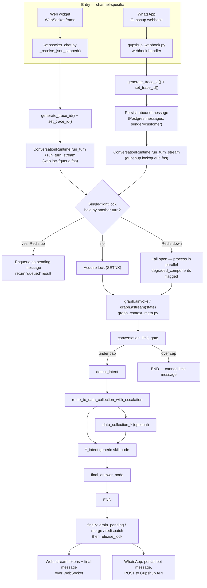
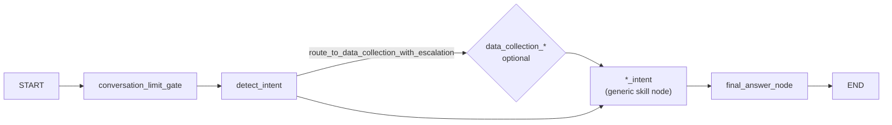
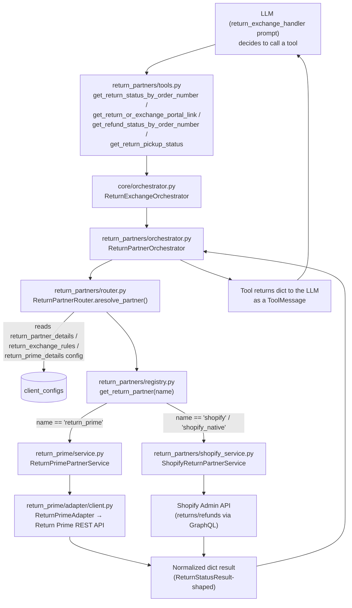

# Chat Message Lifecycle & Return Prime Execution

## Purpose

This document traces one customer message end to end — from the moment it
arrives on a channel, through intent detection, config loading, tool
execution, and back out as a formatted reply — and then goes one level
deeper into a single concrete tool call: a return/exchange query, showing
exactly how Return Prime executes it today and how a different partner
(e.g. Shopify-native) would execute the *same* call without any change to
the agent, the prompt, or the tools the LLM sees.

Every claim below is backed by a `file:line` reference into
`fashion_bot/fashion_bot/`. Where the flow differs between web chat and
WhatsApp, both are shown.

---

## 1. End-to-end request lifecycle



### 1.1 Web chat entry

| Step | Location |
|---|---|
| WebSocket frame received | `websocket_chat.py:127` (`_receive_json_capped`) |
| Trace ID generated + bound to context | `websocket_chat.py:3497,3501` |
| Turn handed to the runtime (non-streaming) | `websocket_chat.py:2024,2056-2063` — `runtime.run_turn(channel="web", execute_fn=_execute_wrapper, trace_id=trace_id)` |
| Turn handed to the runtime (streaming) | `websocket_chat.py:2346-2353` — `runtime.run_turn_stream(channel="web", execute_stream_fn=execute_stream_fn, trace_id=trace_id)` |
| Graph invoked (non-streaming) | `websocket_chat.py:2027-2035` → `invoke_graph_with_tracing(...)`; direct fallback `graph.ainvoke(state)` at `websocket_chat.py:785,808,814` |
| Graph invoked (streaming) | `core/streaming_service.py:442-453` — `graph.astream(state, stream_mode=["custom","values"])`. `"custom"` yields live `{"type":"token",...}` chunks written by the skill node; `"values"` yields the full end state. |
| Tokens pushed to the browser | `websocket_chat.py:2383-2389` → `_send_websocket_event_for_ui` → `websocket.send_json` (`websocket_chat.py:2211,147`) |

### 1.2 WhatsApp entry

| Step | Location |
|---|---|
| Webhook received, trace ID set | `gupshup_webhook.py:762-763` |
| Inbound message persisted **before** the graph runs | `gupshup_webhook.py:938-964` — `astore_message_event_with_conversation_resolution(sender="customer", channel_type="whatsapp", ...)` |
| Runtime wired with WhatsApp-specific lock/queue functions | `gupshup_webhook.py:224-229` — `ConversationRuntime(...)` built from `GupshupRuntimeSupport` |
| Turn run | `gupshup_webhook.py:1603-1616` — `runtime.run_turn_stream(channel="whatsapp", execute_stream_fn=_execute_turn_run_graph_and_update_state_for_gupshup, trace_id=trace_id)` |
| Graph invoked | `gupshup_webhook.py:578-586` — `graph.ainvoke(state, config=config)`, `config.configurable.thread_id = phone_number` for `PostgresSaver` checkpointing (no-checkpoint fallback: `gupshup_webhook.py:604-611`) |
| Trace ID also threaded to LangSmith | `gupshup_webhook.py:561-567` — `config["metadata"]["trace_id"]` |
| Bot reply persisted | `gupshup_webhook.py:1260-1278` (`sender="bot"`) |
| Reply sent to the customer | `gupshup_webhook.py:1297-1303` → `send_message(...)` → `gupshup_webhook.py:310,345-357` POSTs to `https://api.gupshup.io/wa/api/v1/msg` (`gupshup_webhook.py:298`) |

`whatsapp_webhook.py:58` is a legacy/alternate handler that also converges on `graph.ainvoke(state, config=config)` — same graph, same downstream path.

**Both channels invoke the exact same compiled `graph` object from
`graph_context_meta.py`.** There is no channel-specific branch inside the
graph itself — channel only affects entry (WebSocket vs webhook), the
lock/queue implementation used by `ConversationRuntime`, and formatting at
`final_answer_node` (§4).

---

## 2. Single-flight locking & pending-message merge

One conversation processes one turn at a time. A second message arriving
mid-turn is queued and merged, not dropped or run concurrently.

- Lock key: `f"conv:processing:{client_id}:{sender_phone}"` (`core/gupshup_runtime_support.py:58-63`)
- Acquire: `SETNX` with TTL — `try_acquire_processing_lock` (`core/gupshup_runtime_support.py:87-110`)
- If already locked: the new message is `RPUSH`ed onto
  `f"conv:pending:{client_id}:{sender_phone}"` as
  `{trace_id, ts, message_text, payload_data}`, trimmed to
  `PENDING_QUEUE_MAX_MESSAGES` (`core/gupshup_runtime_support.py:127-155`),
  and the caller gets a `"queued"` result immediately
  (`core/conversation_runtime.py:167-193`).
- If Redis itself is unavailable: fail open, process in parallel, and flag
  `degraded_components` / `single_flight_degraded` on state
  (`core/conversation_runtime.py:194-201`, `schema.py:397-399`).
- After the turn completes, the `finally` block drains the pending queue,
  joins queued `message_text` values into one synthetic message
  (`build_merged_payload`, `core/gupshup_runtime_support.py:183-207`,
  bounded by `PENDING_QUEUE_MAX_CHARS`), and redispatches it — only then is
  the lock released (`core/conversation_runtime.py:247-294`).

---

## 3. Inside the graph: intent → agent → tools



`graph_context_meta.py` builds this with LangGraph's `StateGraph`:

- `START → conversation_limit_gate` (`graph_context_meta.py:831`) — enforces
  the per-conversation user-message cap before any agent work runs; over
  the cap, routes straight to `END` with a canned reply
  (`graph_context_meta.py:832-839`).
- `conversation_limit_gate → detect_intent` when under the cap.
- `detect_intent` routes via `route_to_data_collection_with_escalation`
  (`graph_context_meta.py:842-865`) to one of ~17 named `*_intent` nodes —
  `delivery_intent`, `order_intent`, `return_policy_intent`,
  `after_delivery_return_intent` (the return/exchange **execution**
  agent — routes here, not `return_policy_intent`, once an order/request
  is in play), `place_order_intent`, `cart_management_intent`,
  `return_exchange_policy_intent` (pre-sales policy Q&A), and others —
  or to `escalation_handler` / `unknown_handler`.
- Some intents pass through a `data_collection_*` node first (delivery,
  return policy, discount) when more info is needed before the real intent
  node runs (`graph_context_meta.py:867-895`).
- Every intent/policy/escalation/unknown node converges on
  `final_answer` → `END` (`graph_context_meta.py:897-928`).

### 3.1 The generic skill node

Every `*_intent` node is produced by
`create_generic_skill_node(agent_name=..., topic=..., entity_type=...)`
(`nodes/generic_skill_node.py`) — there is no bespoke Python per agent.
What differs per agent is entirely data: the `agent_name` used to fetch a
prompt, and the tool factory registered for that agent (§3.2, §5).

Tool-calling loop, once the node has its prompt and tools:

1. `_invoke_native_tool_loop(...)` runs the loop (`nodes/generic_skill_node.py:219`).
2. Each iteration calls the LLM with tools bound:
   `ai_msg = await _ainvoke_llm(_llm_for_iter, run_messages)`
   (`nodes/generic_skill_node.py:306-325`).
3. If `ai_msg.tool_calls` is non-empty (`nodes/generic_skill_node.py:347`),
   each call is resolved via `tool_map.get(tool_name)` and executed with
   `_ainvoke_tool` (`nodes/generic_skill_node.py:369-435`); the result is
   wrapped as a `ToolMessage` and appended back into `run_messages` — this
   is the tool result re-entering context for the next LLM turn.
4. The loop ends once `ai_msg.tool_calls` is empty; `final_text = ai_msg.text()`
   (`nodes/generic_skill_node.py:343-349`).
5. An alternate path for LangChain 1.0-style agents calls
   `run_agent_graph(...)` (`nodes/generic_skill_node.py:1327`,
   `utils/agent_utils.py:364-433`), which drives its own
   `graph.astream({"messages": messages}, stream_mode=["messages","values"])`
   and streams model tokens through the same `writer` used by the outer graph.

### 3.2 Agent → tool factory → prompt (config loading)

`core/tool_registry.py` is the map from agent name to its tools and prompt:

```python
"return_exchange": {
    "factory": "return_exchange_tools_factory",
    "topic": "return_exchange",
    "prompt_name": "return_exchange_handler",
},
```
(`core/tool_registry.py:126-131`)

- **Prompt**: fetched via `aget_agent_prompt_with_caching(client_id, "return_exchange_handler")`
  (`utils/utils.py:182`) — tiered cache: in-process memory
  (`mem_prompt:{client_id}:{agent_name}`, 10 min TTL) → Redis
  (`agents_config:{client_id}`, whole-agent-list blob, 10 min TTL,
  `utils/utils.py:103-137`) → Postgres `agents_config` table
  (`agent_name`, `agent_prompt` columns). There is no per-agent Redis key —
  a cache miss reloads and re-caches **every** agent's prompt for that
  client in one round trip.
- **Tools**: `return_exchange_tools_factory(state, messages_list)`
  (`tool_factory.py:3156`) builds order-lookup tools
  (`get_customers_delivered_orders_by_phone`, etc.) plus imports
  `create_return_partner_chat_tools` from `return_partners/tools.py`
  (`tool_factory.py:3168`) — the partner-agnostic return/exchange tool set
  (§5).

All other config the agent's tools read at call time (eligibility rules,
policy Q&A, SLA/destination, escalation contacts, vendor contact info) goes
through the same three-tier pattern via `aget_config`/`aget_json_config`
(`config_manager.py:97-144`): in-process memory (`CONFIG_MEMORY_TTL`,
default 600s) → Redis (`cfg:{client_id}:{config_key}`, `CONFIG_REDIS_TTL`,
default 3600s) → Postgres `client_configs` table. Misses are
negative-cached (`cache_none=True`) so a config key that's never been set
for a client is also cached as "absent" until busted or expired.

Config keys the return/exchange path actually reads, by concern:

| Concern | Config key | Read by |
|---|---|---|
| Return/exchange eligibility (window days, delivered requirement, blocked tags) | `return_prime_return_exchange_rules` | `return_prime/workflow/rules.py` (`RETURN_PRIME_RULES_CONFIG_KEY`) |
| Generic (non-Return-Prime) eligibility | `return_exchange_rules` | `return_partners/rules.py` (`RETURN_EXCHANGE_RULES_CONFIG_KEY`) |
| Structured refund destination/SLA (when configured) | `return_exchange_rules.refund` | `return_partners/refunds.py` (`aget_refund_visibility`) |
| Free-text policy Q&A (return/exchange/refund answers, wallet, provider) | `return_exchange_policy` | Policy agent (`policy_handler`); read directly for pre-sales questions |
| Free-text return/exchange process copy | `after_delivery_return_exchange` | Policy tools (`core/tool_registry.py:611-654`) |
| Portal link, how-to-message template, support email | `return_prime_return_exchange_rules.customer_instructions` | `return_partners/instructions.py` |
| Which partner is active for this client | `return_partner_details`, then `return_exchange_rules.primary_return_partner`, then `return_prime_details` credentials | `return_partners/router.py` (§5) |
| Support contact shown in escalations | `vendor_contact_details` | Escalation/policy tools |
| Agent system prompt | `agents_config` table (Postgres, not `client_configs`) | `aget_agent_prompt_with_caching` |

---

## 4. Final answer: composition + channel formatting

`final_answer_intent_node` (`nodes/final_answer_node.py:192`; the
`final_answer_node` name used in the graph is a thin alias at line 477) runs
identically for both channels — there is **no explicit web/WhatsApp branch**
inside the graph. Channel-awareness is folded entirely into one formatting
step:

1. `_format_message()` (`nodes/final_answer_node.py:250-293`) deterministically
   cleans the draft: `replace_urls_in_message_tool` (Shopify → storefront
   URL swap), `clean_markdown_links_tool` (`[text](url)` → bare `url`),
   `format_message_for_whatsapp_tool` / `format_for_whatsapp`
   (`utils/utils.py:708-730` — emoji prefixing by topic, a 550-character
   truncation guard with a narrow keyword whitelist).
2. A second, real LLM call — `final_answer_llm.ainvoke(messages_to_send)`
   (`nodes/final_answer_node.py:322-384`) — applies language-matching,
   tone, and length rules on top of the deterministic draft. This is
   composition, not passthrough.
3. On any exception, a deterministic-only fallback (or generic apology)
   is used instead of failing the turn (`nodes/final_answer_node.py:420-473`).
4. The finished message is appended to `state["messages"]`
   (`nodes/final_answer_node.py:398-400`), then persisted and sent out via
   the channel-specific path from §1 (WebSocket send vs Gupshup POST).

Because both channels share one formatting function, a bug in it is a bug
everywhere — this is exactly where the WhatsApp-only "550-char truncation
with a keyword whitelist that doesn't include return/refund/exchange"
behavior (`utils/utils.py:727-729`) lives, worth keeping in mind for any
return/refund message that runs long.

---

## 5. Return Prime execution — and how another vendor would run instead

The return/exchange tools the LLM sees are **partner-agnostic by
construction** — see `design_docs/RETURN_PARTNER_ORCHESTRATION.md` for the
original architecture proposal; this section documents what's actually
implemented today.



### 5.1 The partner interface

`return_partners/interfaces.py` defines `ReturnPartnerService` as a
`Protocol` — any partner implementing these five async methods can be
routed to:

```python
class ReturnPartnerService(Protocol):
    partner_name: str
    async def get_status_by_order_number(...) -> dict
    async def list_requests_by_order_number(...) -> dict
    async def get_request_by_id(...) -> dict
    async def get_portal_link(...) -> dict
    async def normalize_webhook(...) -> dict
```

### 5.2 Registration

Both real implementations self-register on import:

- `return_prime/service.py:10-13,181` — `class ReturnPrimePartnerService: partner_name = "return_prime"`, then
  `register_return_partner(ReturnPrimePartnerService.partner_name, return_prime_partner_service)`.
- `return_partners/shopify_service.py:17-18,590-591` — `class ShopifyReturnPartnerService: partner_name = "shopify"`,
  registered under both `"shopify"` and `"shopify_native"`.

`return_partners/registry.py:37-51` (`ensure_default_return_partners_registered`)
imports both modules the first time any partner is requested, so both are
always available — which one actually runs is decided per client, per
call, by the router.

### 5.3 Router — per-client partner resolution

`ReturnPartnerRouter.aresolve_partner_name` (`return_partners/router.py:37-86`)
resolves in this order, first match wins:

1. An explicit `partner=` argument (rare — used by internal callers, not the LLM).
2. `client_configs.return_partner_details.primary_return_partner`.
3. `client_configs.return_exchange_rules.primary_return_partner` (or `.partner`).
4. The first `connected: true` entry in `return_partner_details.return_partners`,
   sorted by `priority`.
5. Fallback: if `return_prime_details` has credentials (`x_rp_token` /
   `api_token`, config or env), assume `"return_prime"`.
6. Otherwise `None` — the orchestrator returns "partner not configured."

For the Groovee/reference client this resolves to `"return_prime"` via step 2:

```json
{
  "return_partners": [{"name": "return_prime", "priority": 1, "connected": true}],
  "primary_return_partner": "return_prime"
}
```
(`client_configs.return_partner_details`)

**To move a client to Shopify-native returns, nothing in the graph, the
prompt, or the tools changes** — only `return_partner_details` (or
`return_exchange_rules.primary_return_partner`) needs to say `"shopify"`.
`ReturnPartnerOrchestrator` (`return_partners/orchestrator.py`) calls
whatever `get_return_partner(partner_name)` returns; it has no
Return-Prime-specific code path except one explicit branch that *skips*
the generic `avalidate_return_exchange_rules` step for `partner_name ==
"return_prime"` because Return Prime does its own eligibility check
(`return_partners/orchestrator.py:480`) — every other partner goes through
the shared validation pipeline.

### 5.4 The tools the LLM actually calls

All defined in `return_partners/tools.py` via
`create_return_partner_chat_tools(state)`, wired into the
`return_exchange` agent by `tool_factory.py:3168`:

| Tool | Orchestrator method | Purpose |
|---|---|---|
| `get_return_status_by_order_number` | `ReturnExchangeOrchestrator.aget_return_status` | Status of a return/exchange request |
| `list_return_requests_by_order_number` | `alist_return_requests` | All requests on an order (multi-product) |
| `get_return_request_by_id` | `aget_return_request_by_id` | Exact request by ID |
| `get_return_or_exchange_portal_link` | `aget_return_or_exchange_portal` | Start a new request — returns `portal_url` + eligibility |
| `get_return_pickup_status` | `aget_return_pickup_status` | Reverse-pickup/RTO status |
| `get_refund_status_by_order_number` | `aget_refund_status` | Refund destination + SLA visibility |
| `ensure_exchange_order_created` | `aensure_exchange_order` | Trigger exchange order creation (policy-gated) |
| `get_exchange_delivery_status` | `aget_exchange_delivery_status` | Replacement-order delivery ETA |

Every one of these calls `ReturnExchangeOrchestrator` in
`core/orchestrator.py`, which is a thin pass-through to
`return_partners/orchestrator.py::ReturnPartnerOrchestrator` — the layer
that actually resolves the partner (§5.3) and calls its
`ReturnPartnerService` methods. The LLM never sees `return_prime`-specific
tool names or payload shapes; it only sees the generic dict each
orchestrator method returns (`success`, `status`, `message`, `destination`,
`portal_url`, `should_escalate`, ...).

### 5.5 Return Prime's own execution (current partner)

`return_prime/service.py::ReturnPrimePartnerService.get_portal_link` (used
when starting a new return/exchange):

1. `return_prime_workflow.list_requests_by_order_number(...)` — check for
   an already-open request first; if found, return it instead of a new
   portal link (`_existing_request_response`).
2. `return_prime.workflow.rules.avalidate_return_prime_rules(...)` — the
   Return-Prime-specific eligibility check (window days, delivered
   requirement, blocked product tags) read from
   `return_prime_return_exchange_rules`.
3. `return_prime_workflow.get_return_portal_link(...)` — resolves the
   customer's email/contact, and returns either a personalized deep link
   or the generic `portal_url` fallback from `return_prime_details`.
4. Result merged with the validation payload and returned up the chain
   unchanged in shape to what a Shopify-native partner would return.

Status/refund reads (`get_status_by_order_number`,
`get_refund_status_by_order_number` path) call
`ReturnPrimeAdapter` (`return_prime/adapter/client.py`) against the Return
Prime REST API (`https://admin.returnprime.com`, per
`return_prime_details.api_base`), normalize the response (`data.list` /
`data.request` shapes → common DTO fields), and hand that normalized dict
back to the orchestrator.

### 5.6 What a different vendor would do instead

`return_partners/shopify_service.py::ShopifyReturnPartnerService`
implements the identical five methods against Shopify's Admin GraphQL API
instead of the Return Prime REST API — no portal link concept (Shopify
returns are created via API, not a hosted portal), so `get_portal_link`
either creates the return directly or explains the Shopify-native flow via
the tool's `Shopify-native/no portal_url` branch that the
`return_exchange_handler` prompt already accounts for
(`agents_config.return_exchange_handler`, Step 4 tool-output handling). No
new tool, no new prompt section, no new graph node — only the router's
resolved `partner_name` changes which class's methods execute.

### 5.7 Return Prime's separate, standalone MCP surface

Distinct from the in-process flow above, `return_prime/` also ships as a
standalone service exposing three additional integration surfaces for
**external** systems (not this bot's own chat graph) — documented fully in
`return_prime/docs/README.md`:

1. **Webhook push** — Return Prime → `POST /webhooks/return-prime/{client_id}`
   → verified + stored in Postgres → Dramatiq queue → worker → Gupshup
   WhatsApp template. This is how status-change notifications reach
   customers proactively, independent of any chat turn.
2. **External chat via MCP** — a third-party chat service calls
   `POST /mcp/{client_id}`, an LLM on their side selects an MCP tool
   (`get_return_prime_status_by_order_number`, etc.), which calls the same
   `return_prime_workflow` normalization layer used internally.
3. **Direct MCP tool call** — same tools, no LLM, for external orchestrators
   that want structured JSON directly.

Flow 1 (webhooks) and Flows 2/3 (chat/direct MCP) are not wired together —
webhooks never invoke an LLM, and chat queries always pull live data
rather than reading webhook payloads.

---

## 6. Reference: full request → response chain for "what's my refund status"

```text
Customer: "when will I get my refund for order #gv16780"
  -> websocket_chat.py / gupshup_webhook.py (channel entry, trace_id set)
  -> ConversationRuntime.run_turn_stream (single-flight lock)
  -> graph.astream(state) [graph_context_meta.py]
       -> conversation_limit_gate (under cap)
       -> detect_intent -> "after_delivery_return_intent"
       -> generic skill node (agent_name="return_exchange")
            -> aget_agent_prompt_with_caching(client_id, "return_exchange_handler")
            -> return_exchange_tools_factory(state, messages) builds tools
            -> LLM call #1: decides to call get_refund_status_by_order_number
            -> ReturnExchangeOrchestrator.aget_refund_status
                 -> ReturnPartnerOrchestrator.aget_return_status (identity + status)
                 -> aget_refund_visibility(client_id, request, request_type)
                      -> reads client_configs.return_exchange_rules.refund
                      -> (fallback) client_configs.return_exchange_policy Q&A
                      -> evaluate_sla(...) -> destination + business-day SLA + message
            -> ToolMessage appended to context
            -> LLM call #2 (no more tool calls): drafts final_text
       -> final_answer_node
            -> deterministic URL/markdown/WhatsApp formatting
            -> LLM call #3: language/tone/length pass -> final message
  -> message persisted (Postgres messages table)
  -> sent back: WebSocket send_json (web) or Gupshup POST (WhatsApp)
  -> ConversationRuntime finally: drain pending queue, release lock
```

---

## Related documents

- `design_docs/RETURN_PARTNER_ORCHESTRATION.md` — original multi-partner
  architecture proposal (this document reflects the as-built state).
- `fashion_bot/return_prime/docs/README.md` — Return Prime's three
  standalone production flows (webhook push, external chat MCP, direct MCP).
- `design_docs/WEB_CHAT_IMPLEMENTATION_SUMMARY.md` — WebSocket chat widget details.
- `design_docs/unified_state_cache_design.md` — `StateCache` Redis key design.
- `design_docs/DELHIVERY_INTEGRATION_AND_MULTI_PARTNER_LOGISTICS.md` — the
  equivalent multi-partner pattern for delivery/logistics, same shape as §5.
