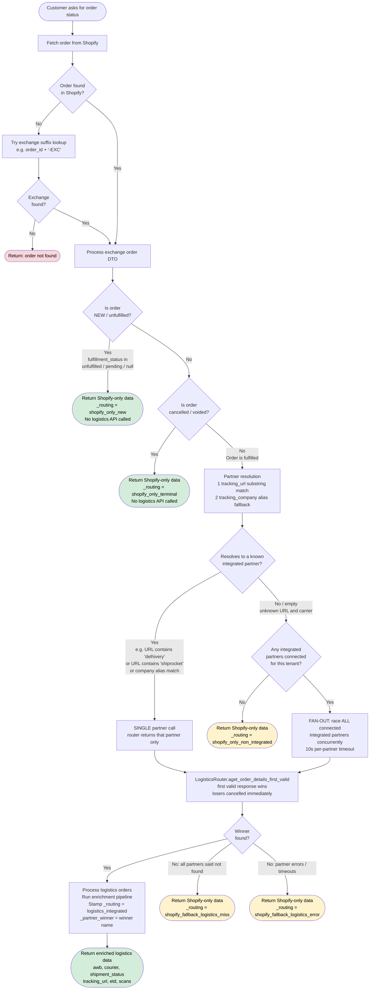
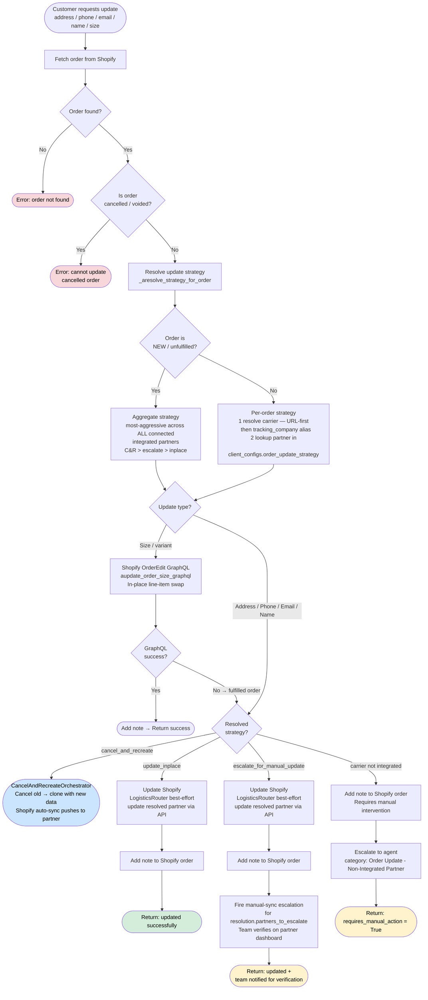
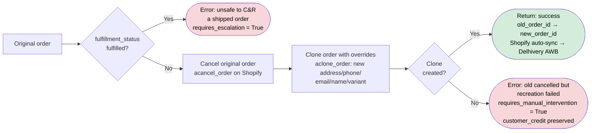
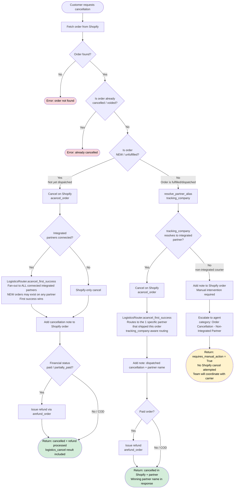

# Delhivery Integration & Multi-Partner Logistics

> Architecture reference for all logistics-aware flows — order status, order updates, and order cancellations — across single-partner (Shiprocket-only) and multi-partner (Shiprocket + Delhivery) tenant configurations.

---

## Diagram 1 — Order Status Flow

Triggered by `get_order_details` tool → `OrderStatusOrchestrator.aget_order_status()`.




### Key Rules


| Condition                                              | Partners called          | Routing tag                        |
| ------------------------------------------------------ | ------------------------ | ---------------------------------- |
| NEW / unfulfilled                                      | None                     | `shopify_only_new`                 |
| Cancelled / voided                                     | None                     | `shopify_only_terminal`            |
| Fulfilled, `tracking_url` or `tracking_company` resolves | That 1 partner only    | `logistics_integrated`             |
| Fulfilled, both URL and company unknown/empty          | All connected integrated | `logistics_integrated`             |
| Fulfilled, no integrated partners                      | None                     | `shopify_only_non_integrated`      |
| Partner timeout / error                                | None (fallback)          | `shopify_fallback_logistics_error` |


> **Partner resolution priority** — `aget_partners_for_order` uses a two-stage resolution:
>
> 1. **`tracking_url` substring match** (`resolve_partner_from_url` in `vendor_config.py`): URL containing `"delhivery"` → `"delhivery"`; URL containing `"shiprocket"` → `"shiprocket"`. This is the authoritative signal because Shiprocket can dispatch an order via Delhivery as the underlying courier, setting `tracking_company='Delhivery'` in Shopify while the actual API platform remains Shiprocket. Without URL-first resolution, the bot would call the Delhivery adapter for an order it has no knowledge of.
>
> 2. **`tracking_company` alias table** (`resolve_partner_alias`): Used only when `tracking_url` does not match any known pattern (typically NEW/unfulfilled orders where `tracking_url` is empty). Exact match first, then prefix match — `"BlueDart Surface 2KG"` → prefix-matches `"bluedart"` → routes to `"shiprocket"`.
>
> The same URL-first logic is applied in `OrderUpdateOrchestrator` and `OrderCancellationOrchestrator` via `effective_partner = resolve_partner_from_url(tracking_url) or tracking_company`.

---

## Diagram 2 — Order Details Update Flow

Triggered by `update_order_address`, `update_order_phone_number_tool`, `update_order_email_tool`, `update_order_name_tool`, `update_order_size_tool`.  
Orchestrated by `OrderUpdateOrchestrator` and — for size — `aupdate_order_size`.




### Update Strategy Matrix — per-partner, per-order

The `order_update_strategy` key in `client_configs` is a **per-partner JSON map** that drives a config-only dispatch in `OrderUpdateOrchestrator`. Adding a new partner to the platform = add one row to the map. **No code changes.** No hardcoded partner names live in the orchestrator.

#### The three strategies

| Config value                  | Behaviour                                                                                                              | Typical partner                                |
| ----------------------------- | ---------------------------------------------------------------------------------------------------------------------- | ---------------------------------------------- |
| `update_inplace`              | Update Shopify + call the partner's edit API. No escalation.                                                           | Shiprocket (full edit API)                     |
| `escalate_for_manual_update`  | Update Shopify + best-effort partner API + fire a manual-sync escalation so ops verifies on the partner dashboard.    | Delhivery default (limited pre-AWB edit API)   |
| `cancel_and_recreate`         | Cancel the original Shopify order; clone it with the new data. Rely on Shopify auto-sync to push to the partner.       | Delhivery opt-in (no usable edit API pre-AWB)  |

`escalate_for_manual_update` is the safe fallback when a partner is connected but absent from the map.

#### Config format — per-partner JSON dict (recommended)

```json
{"shiprocket": "update_inplace", "delhivery": "cancel_and_recreate"}
```

Each key is a canonical partner name (lowercase). Every connected integrated partner should be listed explicitly so the behaviour is discoverable. Partners **not listed** default to `escalate_for_manual_update` (safe default for unknown API capabilities).

#### Config format — legacy plain string (backward-compatible)

```
cancel_and_recreate
```

A plain string is still parsed and applied uniformly to every connected partner. Existing tenants with a plain-string config continue to work unchanged.

#### Per-order strategy resolution (`_aresolve_strategy_for_order`)

`OrderUpdateOrchestrator._aresolve_strategy_for_order(state, order_dto)` runs in two modes:

1. **Per-order resolution** (preferred path — used when `order_dto` is provided AND the order is past NEW state):
    1. Resolve the *actual* carrier for THIS order via `aresolve_effective_partner_for_order` — URL-first (`tracking_url` substring → canonical name) with `tracking_company` alias as fallback.
    2. Look up that single partner's strategy via `aget_partner_update_strategy(canonical, client_id)`.
    3. Return `UpdateStrategyResolution(strategy=<that partner's strategy>, partner=<canonical>)`.
    
    **Outcome**: a tenant configured `{"shiprocket": "update_inplace", "delhivery": "cancel_and_recreate"}` will C&R **only Delhivery-shipped orders**; Shiprocket-shipped orders go through the inplace API path. Strategy is decided per-order, not tenant-wide.

2. **Aggregate fallback** (used for NEW / unfulfilled orders or when `order_dto` is missing):
    Iterates **all** connected integrated partners; aggressive-most-wins (`cancel_and_recreate` > `escalate_for_manual_update` > `update_inplace`). NEW orders have no carrier yet, so the per-order partner can't be resolved — aggregate behaviour is the right call there.

The returned `UpdateStrategyResolution` has:

- `strategy` — one of `STRATEGY_UPDATE_INPLACE`, `STRATEGY_ESCALATE_WITH_PARTNERS`, `STRATEGY_CANCEL_AND_RECREATE`.
- `partner` — the single canonical carrier this resolution applies to (per-order path) or `None` (aggregate path).
- `partners_to_escalate` — non-empty only for `STRATEGY_ESCALATE_WITH_PARTNERS`. Single-element for per-order, full list for aggregate.

#### Behaviour matrix

| Merchant config                                                         | Order's actual carrier (URL-resolved)  | Address / Phone / Email / Name                                                          | Size / Variant                                  |
| ----------------------------------------------------------------------- | -------------------------------------- | --------------------------------------------------------------------------------------- | ----------------------------------------------- |
| `{"shiprocket": "update_inplace", "delhivery": "cancel_and_recreate"}`  | shiprocket                             | Update Shopify + Shiprocket API. No escalation.                                          | GraphQL in-place line-item swap.                |
| `{"shiprocket": "update_inplace", "delhivery": "cancel_and_recreate"}`  | delhivery                              | Cancel old order → clone with new data. Shopify auto-syncs to Delhivery (new AWB).       | Same C&R path.                                  |
| `{"delhivery": "escalate_for_manual_update"}` **(default for Delhivery)** | delhivery                            | Update Shopify + Delhivery API best-effort + fire manual-sync escalation for ops verify. | GraphQL swap; if fulfilled, fall through to escalation. |
| `{"shiprocket": "update_inplace"}`                                      | NEW order (no carrier yet)              | Aggregate fallback → `update_inplace` (only inplace partner connected).                  | Same.                                           |
| *(partner connected but absent from map)*                               | that partner                            | `escalate_for_manual_update` (safe default for unknown API).                             | Same.                                           |
| Plain string `"cancel_and_recreate"`                                    | any                                     | Applied uniformly across partners.                                                       | Same.                                           |

#### How to decide which strategy to set for a partner

The decision comes down to one question: **does the partner's API allow editing an order before an AWB (waybill) is generated?**


| Partner edit-API capability                                       | Correct strategy             | Reasoning                                                                                                                                                                                                                                                          |
| ----------------------------------------------------------------- | ---------------------------- | ------------------------------------------------------------------------------------------------------------------------------------------------------------------------------------------------------------------------------------------------------------------ |
| Full edit API — works at any order state (pre-AWB and post-AWB)   | `update_inplace`             | API handles the update, no escalation needed. Shiprocket is this case.                                                                                                                                                                                              |
| Edit API exists but only works **after** AWB is assigned          | `escalate_for_manual_update` | Bot updates via API when AWB exists; for pre-AWB orders, fires escalation so the team verifies on the partner dashboard once AWB is generated.                                                                                                                      |
| **No edit API at all** (pre-AWB orders cannot be touched via API) | `cancel_and_recreate`        | Only way to change the order before shipment. Bot cancels the original Shopify order and clones it with the new data. Shopify's auto-sync creates a fresh order on the partner with correct details. **Trade-off**: customer gets a new order number. Requires explicit merchant opt-in. |
| Edit API exists but **unreliable / undocumented**                 | `escalate_for_manual_update` | Safe default — attempt via API and always notify team to verify.                                                                                                                                                                                                    |


**Delhivery specifically**: `POST /api/p/edit` requires a waybill. Pre-AWB orders (status = Pending) have no AWB yet, so the API call will fail. This is why Delhivery tenants need either `cancel_and_recreate` (automated, merchant opt-in) or `escalate_for_manual_update` (default — team verifies via the Delhivery One dashboard after AWB is generated).

**Shiprocket specifically**: full edit API works at any order state → `update_inplace`. List Shiprocket explicitly in the map for discoverability rather than relying on absence-from-dict semantics.

**How to confirm for a new partner**: Check the partner's API documentation for an order-edit or address-update endpoint. If it lists a required `waybill` / `awb` parameter, the partner cannot update pre-AWB orders via API → set `escalate_for_manual_update` or `cancel_and_recreate`. If there is no such restriction → set `update_inplace`.

#### Required prompt instruction for update agents

Add this block to the system prompt of any agent that calls order update tools
(`update_order_address`, `update_order_phone_number_tool`, `update_order_email_tool`,
`update_order_name_tool`, `update_order_size_tool`):

```
CANCEL-AND-RECREATE CONFIRMATION RULE:
When you call an order update tool and the response contains "requires_confirmation": true
with "strategy": "cancel_and_recreate":
1. Show the customer the exact "message" field from the tool response — do not paraphrase it.
2. Ask for explicit confirmation before proceeding (e.g. "Shall I go ahead?").
3. If the customer says yes / okay / proceed / any confirmation related text — call the SAME tool again with
   all the same arguments and confirmed=true.
4. If the customer says no / cancel / declines — acknowledge and do not call the tool again.
Do NOT call the update tool with confirmed=true until the customer has explicitly agreed.
```

#### Setting the config in Postgres

```sql
-- New tenant onboarding — recommended form lists every connected partner
-- explicitly so behaviour is discoverable from the row alone.
INSERT INTO client_configs (client_id, config_key, config_value)
VALUES (
  '<client_id>',
  'order_update_strategy',
  to_jsonb('{"shiprocket": "update_inplace", "delhivery": "cancel_and_recreate"}'::text)
)
ON CONFLICT (client_id, config_key) DO UPDATE SET
  config_value = EXCLUDED.config_value;
```

> **Redis cache**: `order_update_strategy` is cached with a 10-minute TTL (`CONFIG_MEMORY_TTL`). After updating Postgres, wait up to 10 minutes for the change to propagate, or restart the bot process to flush the in-memory cache immediately.

### Cancel-and-Recreate (`CancelAndRecreateOrchestrator`)




**Why it exists**: Delhivery's edit API (`POST /api/p/edit`) requires a waybill (AWB). Pre-AWB orders (Pending status on Delhivery) cannot be edited via API. Cancel-and-recreate on Shopify triggers a fresh auto-sync → Delhivery generates a new AWB with the correct data.

**Trade-off**: Customer gets a new order number. Gated behind merchant opt-in (`order_update_strategy = cancel_and_recreate`).

---

## Diagram 3 — Order Cancellation Flow

Triggered by `cancel_order_tool` → `CancellationOrchestrator.acancel_order()`.




### Cancellation Decision Table


| Order state                               | Partners            | Shopify cancel  | Logistics cancel | Refund     |
| ----------------------------------------- | ------------------- | --------------- | ---------------- | ---------- |
| NEW, no integrated partners               | —                   | ✅               | —                | If prepaid |
| NEW, integrated partners connected        | Fan-out ALL (race)  | ✅               | ✅ first success  | If prepaid |
| Fulfilled, tracking_company resolves      | That 1 partner only | ✅               | ✅ (that partner) | If prepaid |
| Fulfilled, tracking_company unknown/empty | Fan-out ALL         | ✅               | ✅ first success  | If prepaid |
| Fulfilled, non-integrated carrier         | —                   | ❌ not attempted | ❌                | ❌          |
| Already cancelled / voided                | —                   | ❌               | ❌                | ❌          |


> **NEW orders fan-out for cancellation**: Unlike status queries (which skip logistics entirely for NEW orders), cancellation actively tries to cancel on every connected integrated partner because a NEW order may already have been pushed and picked up by any of them. `acancel_first_success` uses `_best_effort_writes` — slow partners are shielded (not cancelled) and their outcome is logged.

---

## Order Status JSON Assembly — Field-Level Reference

Explains exactly how the final order object is constructed from Shopify + logistics partner data and what the LLM receives.

### Pipeline summary

```
Shopify aget_order_details (raw dict)
    │
    ▼
ShopifyOrderProcessor.process_order → shopify_order_dto
    │
    ├── NEW / cancelled / no partner → return shopify_order_dto as-is (+ _routing tag)
    │
    └── fulfilled → LogisticsRouter wins
            │
            ▼
        winner.process_orders(raw_logistics_response) → OrderInfoDTO
            │
            ▼
        Enrichers.aenrich (optional, per client config)
            │
            ▼
        Stamp _routing / _partner_winner / _checked_partners
            │
            ▼
        get_order_details tool builds final LLM-facing JSON
```

---

### Stage 1 — Shopify fields (`shopify_order_dto`)

Produced by `ShopifyOrderProcessor.process_order` from the raw Shopify Admin API response.

| Field | Source | Notes |
|---|---|---|
| `order_id` | `name` (e.g. `#GV15361`) | Shopify display name |
| `channel_order_id` | `name` without `#` | Used for logistics lookups |
| `status` | Derived (`classify_status`) | `"Confirmed"` / `"Shipped"` / `"Cancelled"` / `"Processing"` |
| `partner_status` | `""` | Empty — not yet enriched by logistics |
| `shipment_status` | Latest fulfillment `shipment_status` | e.g. `"in_transit"` |
| `fulfillment_status` | Shopify `fulfillment_status` | `"fulfilled"` / `"unfulfilled"` / `null` |
| `financial_status` | Shopify `financial_status` | `"paid"` / `"pending"` / `"cod"` etc. |
| `customer` | `customer.first_name + last_name` | Falls back to `"Guest"` |
| `courier` | Latest fulfillment `tracking_company` | e.g. `"Delhivery"` / `"Shiprocket Assigned"` |
| `tracking_company` | Same as `courier` | Used for partner alias resolution |
| `tracking_url` | Latest fulfillment `tracking_url` | May be empty for new orders |
| `awb` | First entry of `tracking_numbers[]` | |
| `items` | Line item name strings | |
| `products` | Same as `items` | Alias |
| `line_items` | List of dicts: `name`, `quantity`, `unit_price`, `discount`, `final_price`, `fulfillment_status` | |
| `delivery_date` | `null` | Filled by logistics partner later |
| `delivered_date` | `null` | Filled by logistics partner later |
| `out_for_delivery_date` | `null` | Filled by logistics partner later |
| `cancelled_at` | Shopify `cancelled_at` | ISO timestamp or `null` |
| `total_price` | Shopify `total_price` (float) | |
| `currency` | Shopify `currency` | `"INR"` |
| `created_at` | Shopify `created_at` | |
| `updated_at` | Shopify `updated_at` | |
| `source` | `"shopify"` or `"shopify_exchange"` | |
| `_routing` | Set by orchestrator | See routing table below |

> **When Shopify data is final (no logistics call):** orders returned at this stage have `_routing` = `shopify_only_new`, `shopify_only_terminal`, or `shopify_only_non_integrated`. No logistics fields are added.

---

### Stage 2a — Shiprocket processor fields

Produced by `ShiprocketOrderProcessor.process_orders`. **Replaces** the Shopify DTO entirely — all fields below are authoritative from Shiprocket.

| Field | Shiprocket source | Notes |
|---|---|---|
| `order_id` | Shiprocket numeric order ID | |
| `channel_order_id` | `channel_order_id` | Shopify name without `#` |
| `status` | `classify_status(raw_status, cancelled_at)` | Normalized: `"Delivered"` / `"In Transit"` / `"RTO"` / `"Cancelled"` / `"Not Yet Dispatched"` etc. |
| `partner_status` | Raw Shiprocket status string | e.g. `"DELIVERED"`, `"PICKUP SCHEDULED"` |
| `shipment_status` | Raw status or wrapper `shipment_status` | |
| `customer` | `billing_customer_name` | |
| `customer_phone` | `billing_phone` | |
| `billing_phone` | Same | |
| `courier` | `shipments[0].courier` | Actual courier name e.g. `"BlueDart"` |
| `tracking_company` | Same as `courier` | |
| `tracking_url` | `shipments[0].tracking_url` | |
| `awb` | `shipments[0].awb` | |
| `delivery_date` | ETD if not delivered; actual `delivered_date` if `DELIVERED` | |
| `delivered_date` | `shipments[0].delivered_date` | |
| `out_for_delivery_date` | From canonical `out_for_delivery_date` field | |
| `items` / `products` | Product name strings from `products[]` | |
| `created_at` | Shiprocket `created_at` | |
| `updated_at` | Shiprocket `updated_at` | |
| `source` | `"shiprocket"` | |
| `partner_name` | `"shiprocket"` | |

---

### Stage 2b — Delhivery processor fields

Produced by `DelhiveryOrderProcessor.process_orders` from the `Shipment` block of Delhivery's Track API.

| Field | Delhivery source | Notes |
|---|---|---|
| `order_id` | `AWB` (waybill number) | |
| `channel_order_id` | Reference order ID | Shopify name |
| `status` | `classify_status(normalized_status)` | Same normalized values as Shiprocket |
| `partner_status` | Delhivery `Status.Status` | e.g. `"In Transit"`, `"Delivered"` |
| `shipment_status` | Normalized from `Status.Status` | |
| `customer` | `Consignee.Name` | |
| `customer_phone` | `Consignee.Telephone1` / `Telephone2` | |
| `billing_phone` | Same | |
| `courier` | Constant `"Delhivery"` | |
| `tracking_company` | `"Delhivery"` | |
| `tracking_url` | `https://www.delhivery.com/track-v2/package/{AWB}` | Constructed |
| `awb` | `AWB` | |
| `delivery_date` | `ExpectedDeliveryDate` | |
| `delivered_date` | Timestamp from scan where `ScanDetail.Scan = "Delivered"` | |
| `out_for_delivery_date` | From `out_for_delivery_date` canonical | |
| `items` / `products` | `[ProductDetails]` | |
| `scans` | Flattened scan history: `[{date, status, location, activity, sr-status}]` | Delhivery-exclusive field — not present on Shiprocket orders |
| `created_at` | `OrderDate` or `PickedupDate` | |
| `updated_at` | `Status.StatusDateTime` | |
| `source` | `"delhivery"` | |
| `partner_name` | `"delhivery"` | |

---

### Stage 3 — Enrichers (optional, per client config)

Enrichers run **after** the logistics processor and mutate orders in place. All disabled by default; enabled per client via `VendorConfig.enrichment_pipeline`.

| Enricher | Trigger | Fields added / overridden |
|---|---|---|
| `shopify_graphql` | `enricher_type = "shopify_graphql"` | Replaces `items` with current line items from Shopify GraphQL (up to 5 most recent orders) |
| `shopify_tracking` | `enricher_type = "shopify_tracking"`, only when `tracking_url` is empty | Sets `tracking_url`, `courier`, `awb` from a fresh Shopify fetch |
| `shiprocket_status` | `enricher_type = "shiprocket_status"` | Adds `partner_status`, `shiprocket_raw_status`, `status_source = "shiprocket"`; re-derives `status` |
| `delhivery_status` | `enricher_type = "delhivery_status"` | Adds `partner_status`, `partner_name = "delhivery"`, `status_source = "delhivery"`; re-derives `status` |

---

### Stage 4 — Routing metadata (internal, not shown to LLM)

Stamped by the orchestrator on every returned order. Used by update-rule logic inside `tool_factory.py._acheck_update_rules`.

| `_routing` value | Meaning | `is_integrated` in rules |
|---|---|---|
| `shopify_only_new` | Unfulfilled order — no logistics call made | `False` |
| `shopify_only_terminal` | Cancelled/voided — no logistics call made | `False` |
| `shopify_only_non_integrated` | No connected integrated partner | `False` |
| `shopify_fallback_logistics_miss` | Partners queried — order not found | `False` |
| `shopify_fallback_logistics_error` | Partner race timed out / errored | `False` |
| `logistics_integrated` | Winner found — data from partner processor | `True` |

Additional metadata keys on logistics-integrated orders:

| Key | Example value |
|---|---|
| `_partner_winner` | `"delhivery"` |
| `_checked_partners` | `["delhivery", "shiprocket"]` |

---

### Stage 5 — Final JSON sent to the LLM (`get_order_details` tool)

The `get_order_details` tool in `tool_factory.py` assembles its own JSON from `aget_order_status_summary` and the raw Shopify record. This is what the LLM agent actually sees.

```json
{
  "success": true,
  "phone_validated": true,
  "order_id": "#GV15361",
  "created_at": "2024-03-15T10:30:00+05:30",
  "financial_status": "paid",
  "fulfillment_status": "fulfilled",
  "cancelled_at": null,
  "total_price": "1299.00",
  "currency": "INR",
  "customer": {
    "name": "Priya Sharma",
    "email": "priya@example.com",
    "phone": "9876543210"
  },
  "shipping_address": {
    "address1": "123 MG Road",
    "address2": "Koramangala",
    "city": "Bengaluru",
    "state": "Karnataka",
    "zip": "560034",
    "country": "India"
  },
  "line_items": [
    {
      "title": "Floral Kurta Set",
      "variant_title": "M",
      "quantity": 1,
      "price": "1299.00",
      "sku": "FKS-M",
      "product_id": "123456",
      "variant_id": "789012"
    }
  ],
  "tags": "BLOOMERCE_CREATED",
  "note": "Gift wrap requested",
  "shipment_status": "in_transit",
  "tracking": {
    "awb": "3814512345678",
    "courier": "Delhivery",
    "expected_delivery": "2024-03-18",
    "current_location": "Bengaluru Hub",
    "tracking_url": "https://www.delhivery.com/track-v2/package/3814512345678"
  },
  "delivered_date": null,
  "logistics_status": "In Transit",
  "logistics_order_id": "3814512345678",
  "logistics_partner": "delhivery",
  "_checked_partners": ["delhivery"],
  "_logistics_enrichment_skipped": null
}
```

**Field source map for the LLM-facing JSON:**

| LLM JSON field | Source |
|---|---|
| `order_id` | `shopify_order_dto.order_id` |
| `created_at` | `shopify_order_dto.created_at` |
| `financial_status` | `shopify_order_dto.financial_status` |
| `fulfillment_status` | `shopify_order_dto.fulfillment_status` |
| `cancelled_at` | `shopify_order_dto.cancelled_at` |
| `total_price` / `currency` | Shopify raw order |
| `customer` | Shopify raw customer block |
| `shipping_address` | Shopify raw `shipping_address` |
| `line_items` | Shopify raw `line_items` (with `variant_id`, `product_id`) |
| `tags` / `note` | Shopify raw order |
| `shipment_status` | `summary_dto.shipment_status` (from logistics if available) |
| `tracking.awb` | `summary_dto.awb` → logistics processor `awb` field |
| `tracking.courier` | `summary_dto.courier` → logistics processor `courier` field |
| `tracking.expected_delivery` | `summary_dto.etd_date` → ETD from logistics, else the partner race's `shipments.etd` / `etd_date` / `delivery_date`. Always routed through `partner_response_mappings.normalize_etd_if_current` |
| `tracking.current_location` | Delhivery: last scan `location`; Shiprocket: not available |
| `tracking.tracking_url` | `summary_dto.tracking_url` → logistics processor |
| `delivered_date` | `summary_dto.delivered_date` |
| `logistics_status` | `summary_dto.status` → normalized status from logistics |
| `logistics_order_id` | `summary_dto.order_id` → partner order / AWB ID |
| `logistics_partner` | `order._partner_winner` |
| `_checked_partners` | `order._checked_partners` |
| `_logistics_enrichment_skipped` | `"new_or_cancelled"` when `_routing` is shopify-only |

> **Delhivery vs Shiprocket difference visible to LLM:** Delhivery orders include `scans` (full scan history) and always populate `tracking.current_location` from the latest scan. Shiprocket orders do not have a `scans` field; `current_location` is omitted or `null`.

> **Stale-ETA suppression (LLM-facing contract).** Partners keep returning the
> original ETD long after it has elapsed, and an LLM handed a past date states
> it as a future promise ("it will arrive on 20 Jul 2026", said on 5 Aug).
> Every ETA that reaches the model therefore goes through
> `partner_response_mappings.normalize_etd_if_current`, which returns `""` when
> the ETD is **before today's IST date** and the order is still in flight.
> Delivered orders pass `is_delivered=True` and keep the date, which is then a
> historical fact rather than a promise. Consequences for callers:
>
> - An empty `tracking.expected_delivery` / `expected_delivery` means "no ETA
>   available **or** the courier's ETA is stale" — it is never an error state,
>   and the tool contracts already document `""` as valid.
> - The comparison is IST, matching the `Today is <date> (IST)` grounding block
>   the skill node injects. Do not switch it to UTC — that reopens a
>   00:00–05:30 IST window each day in which yesterday's ETA reads as current.
> - Suppression is fail-open: an ETD that cannot be parsed at all is passed
>   through unchanged, so a valid future date is never hidden by accident.
> - New code must not format a partner ETD for the LLM with bare
>   `normalize_etd` — use `normalize_etd_if_current` so the rule stays in one
>   place.

---

## Partner Resolution Reference

All three flows use the same `resolve_partner_alias()` function from `vendor_config.py`:

```
tracking_company (raw from Shopify fulfillment)
    │
    ▼
normalize: strip + lowercase
    │
    ├── Exact match in DELIVERY_PARTNER_ALIASES? → return canonical
    │
    └── Prefix match (longest alias first)?       → return canonical
            │
            └── No match → None → fan-out or skip
```


| Raw `tracking_company`   | Resolved canonical | Partner called         |
| ------------------------ | ------------------ | ---------------------- |
| `"Delhivery"`            | `"delhivery"`      | Delhivery only         |
| `"Shiprocket"`           | `"shiprocket"`     | Shiprocket only        |
| `"Shiprocket Assigned"`  | `"shiprocket"`     | Shiprocket only        |
| `"BlueDart Surface 2KG"` | `"shiprocket"`     | Shiprocket only        |
| `"Ecom Express Heavy"`   | `"shiprocket"`     | Shiprocket only        |
| `"DTDC Express"`         | `"shiprocket"`     | Shiprocket only        |
| `"FedEx"`                | `None`             | Fan-out all / escalate |
| *(empty)*                | `None`             | Fan-out all / escalate |


---

## Adding a New Delivery Partner (Runbook)

> This architecture was designed so adding a new integrated partner is predominantly a copy-paste-and-rewrite-API-calls exercise with **very few touch-points in shared code**.  Use this as a runbook when BlueDart (or any other partner) needs to be integrated.

### Files to CREATE — new partner package

Mirror the `fashion_bot/delhivery/` layout exactly:

```
fashion_bot/bluedart/
├── __init__.py                          ← register_partner(...) called at import time
├── tools/
│   ├── __init__.py                      (empty)
│   ├── logistics_adapter.py             ← BluedartLogisticsAdapter(LogisticsInterface)
│   └── order_adapter.py                 ← BluedartOrderAdapter(OrderInterface)
├── processors/
│   ├── __init__.py                      (empty)
│   └── order_processor.py               ← ~30 lines — calls build_order_info_dto_from_canonical
├── enrichers/                           (optional — only if BlueDart has bulk status enrichment)
│   ├── __init__.py
│   └── status_enricher.py
├── webhook/
│   ├── __init__.py                      ← re-exports bluedart_webhook_router
│   ├── bluedart_webhook.py              ← FastAPI router for inbound webhooks
│   └── event_processor.py              ← processes inbound events, persists to shipment_events
└── modules/                             (optional — only needed for cancel-and-recreate strategy)
    ├── __init__.py
    └── create_bluedart_order.py
```

The only "wiring" file is `__init__.py` — direct copy of `fashion_bot/delhivery/__init__.py`, change `"delhivery"` → `"bluedart"` and update imports:

```python
# fashion_bot/bluedart/__init__.py
from fashion_bot.core.logistics_registry import PartnerRegistration, register_partner
from fashion_bot.bluedart.tools.logistics_adapter import BluedartLogisticsAdapter
from fashion_bot.bluedart.tools.order_adapter import BluedartOrderAdapter
from fashion_bot.bluedart.processors.order_processor import BluedartOrderProcessor
from fashion_bot.bluedart.webhook import bluedart_webhook_router

async def _aget(client_id): return await BluedartLogisticsAdapter.create(client_id=client_id)
def _get(client_id):        return BluedartLogisticsAdapter(client_id=client_id)
def _order(client_id):      return BluedartOrderAdapter(client_id=client_id)
async def _cancel_recreate(**kw):
    from fashion_bot.bluedart.modules.create_bluedart_order import aupdate_bluedart_order_size
    return await aupdate_bluedart_order_size(**kw)

register_partner(PartnerRegistration(
    name="bluedart",
    async_logistics_factory=_aget,
    sync_logistics_factory=_get,
    order_adapter_factory=_order,
    processor_factory=BluedartOrderProcessor,
    webhook_router=bluedart_webhook_router,
    cancel_recreate_handler=_cancel_recreate,
    enricher_type="bluedart_status",   # omit if no enricher
    enricher_factory=None,
    order_search_result_key=None,      # e.g. "shipments" if API wraps results
))
```

The bulk of the work is `logistics_adapter.py` — BlueDart's actual HTTP calls (token auth, GET tracking, POST edit, POST cancel, GET ETA).  That is unavoidable; it is the integration itself.

---

### Files to EDIT — shared code (typically 3–4 one-liners)

| File | Change | Why |
|---|---|---|
| `core/logistics_registry.py` | Append `"fashion_bot.bluedart"` to `_PARTNER_MODULES` list | Triggers autodiscover at startup which calls `register_partner(...)` |
| `core/partner_response_mappings.py` | Add one sub-dict per partner in each of `GET_ORDER_DATA_FIELD_MAPS`, `WEBHOOK_STATUS_TO_EVENT_KEY`, `FULFILLMENT_STATUS_RULES`, `KNOWN_FULFILLED_STATUSES` | Maps BlueDart's response shape and status vocabulary to the canonical internal shape |
| `core/vendor_config.py` — `DELIVERY_PARTNER_ALIASES` | Change `"bluedart": "shiprocket"` and `"blue dart": "shiprocket"` entries to resolve to `"bluedart"` | Today these aliases route BlueDart-via-Shiprocket sub-carrier shipments to the Shiprocket adapter.  Once BlueDart is a first-class partner the alias must resolve to the BlueDart adapter |
| `core/vendor_config.py` — `TRACKING_URL_PATTERNS` | Add a regex/substring for BlueDart's tracking URL (e.g. `"bluedart"` substring) | Enables URL-first partner resolution so orders shipped directly via BlueDart are identified correctly |
| `agent_controller.py` | `from fashion_bot.bluedart.webhook import bluedart_webhook_router; app.include_router(...)` | Mounts BlueDart's inbound webhook routes |

**Zero changes required in:** `factory.py`, `orchestrator.py`, `logistics_router.py`, `order_editing_graphql.py`, any other partner's adapter, the DB schema, or any tool definition in `tool_factory.py`.

---

### Configurable per-tenant fields (DB only — no code change)

```sql
INSERT INTO client_configs (client_id, config_key, config_value)
VALUES (
  '<tenant_uuid>',
  'bluedart_details',
  to_jsonb(jsonb_build_object(
    'api_token',        '<BLUEDART_API_TOKEN>',
    'api_base',         'https://netconnect.bluedart.com/...',
    'order_id_prefix',  ''   -- empty if BlueDart stores Shopify order_number directly
  )::text)
)
ON CONFLICT (client_id, config_key) DO UPDATE SET config_value = EXCLUDED.config_value;
```

Also follow the same 4-step Delhivery onboarding pattern in the DB:
1. `delivery_partners` — insert `bluedart` row
2. `delivery_partner_integrations` — insert tenant row with `status='active'`, `is_connected=1`
3. `client_configs.bluedart_details` — insert API credentials above
4. `gupshup_templates` — insert WhatsApp notification templates for BlueDart status events

Optionally set the update strategy for the partner:

```sql
UPDATE client_configs
SET config_value = config_value || '{"bluedart": "cancel_and_recreate"}'::jsonb
WHERE client_id = '<tenant_uuid>' AND config_key = 'order_update_strategy';
```

---

### order_id_prefix calibration (same as Delhivery — required once per tenant)

Run this curl matrix on a known-manifested BlueDart order to discover the right `order_id_prefix`:

```bash
TOKEN='<tenant BlueDart API token>'
SAMPLE_REF='#gv15361'     # real Shopify order_name for this tenant
SAMPLE_AWB='<AWB from BlueDart dashboard>'

# Sanity: token + AWB-based lookup works
curl -s '.../track?waybill='$SAMPLE_AWB -H "Authorization: Token $TOKEN" | jq

# Try each ref_id format — whichever returns data is the prefix to set
for q in "%23$SAMPLE_REF" "$SAMPLE_REF" "${SAMPLE_REF#\#}"; do
  echo "--- ?ref_ids=$q ---"
  curl -s ".../track?ref_ids=$q" -H "Authorization: Token $TOKEN" | jq
done
```

---

### Estimated effort

For a partner with comparable API complexity to Delhivery (REST-based, token auth, similar lifecycle):

| Area | Effort |
|---|---|
| Integration code | 600–900 LOC across the `bluedart/` package — adapter ~400 LOC, webhook event processor ~200 LOC, processor + `register_partner` ~50 LOC each |
| Shared-code edits | 4 lines total across `logistics_registry.py`, `vendor_config.py`, `agent_controller.py`, plus 4 dict entries in `partner_response_mappings.py` |
| DB / ops | Same 4-step SQL pattern as Delhivery onboarding |
| Live testing | Same matrix as Delhivery — "Where is my order?" through manifested + pre-AWB orders; address/phone/email update flows; escalation paths |

Adding a partner is a **configuration-and-integration task, not an architectural one**.  The shared dispatch / mapping / router code stays untouched.

---

## Related Code


| Concern                              | File                                                                                                      |
| ------------------------------------ | --------------------------------------------------------------------------------------------------------- |
| Order status orchestration           | `core/orchestrator.py` → `OrderStatusOrchestrator.aget_order_status`                                      |
| Update orchestration                 | `core/orchestrator.py` → `OrderUpdateOrchestrator.aupdate_order`                                          |
| Cancel-and-recreate                  | `core/orchestrator.py` → `CancelAndRecreateOrchestrator.aupdate_via_clone`                                |
| Cancellation orchestration           | `core/orchestrator.py` → `CancellationOrchestrator.acancel_order`                                         |
| Partner routing                      | `core/logistics_router.py` → `LogisticsRouter`                                                            |
| Partner selection                    | `utils/delivery_partner_utils.py` → `aget_partners_for_order`                                             |
| Alias resolution                     | `core/vendor_config.py` → `resolve_partner_alias`                                                         |
| Update strategy config (per-partner) | `config_manager.py` → `aget_partner_update_strategy`                                                      |
| Update strategy resolution           | `core/orchestrator.py` → `OrderUpdateOrchestrator._aresolve_update_strategy` → `UpdateStrategyResolution` |
| Manual-sync escalation               | `core/orchestrator.py` → `OrderUpdateOrchestrator._aescalate_partners_manual_sync`                        |
| `get_order_details` tool enrichment  | `tool_factory.py` → `_create_get_order_details_tool`                                                      |


