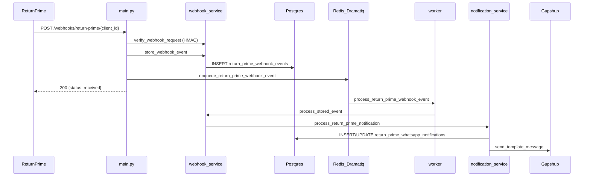

# Return Prime Services

This document explains the Return Prime integration: three production flows, Dramatiq worker architecture, event workflow, and unit-test coverage.

## Three Production Flows

Return Prime runs as **three independent flows** today. They share the same adapter and workflow normalization layer but have different entry points and triggers.

```mermaid
flowchart TB
    subgraph flow1 [Flow 1 - Webhook Push]
        RP1[Return Prime SaaS] -->|POST webhook| WebhookRoute["/webhooks/return-prime/{client_id}"]
        WebhookRoute --> Verify[verify + store in Postgres]
        Verify --> Enqueue[Dramatiq enqueue]
        Enqueue --> RedisQueue[(Redis queue)]
        RedisQueue --> Worker[return_prime worker]
        Worker --> Notify[process_return_prime_notification]
        Notify --> Gupshup[WhatsApp via Gupshup]
        WebhookRoute -->|immediate ACK| ACK["{status: received}"]
    end

    subgraph flow2 [Flow 2 - External Chat via MCP]
        ExtChat[External chat service] -->|HTTP /mcp/{client_id}| MCP[MCP server]
        MCP --> LLM[LLM selects tool]
        LLM --> Tools[return_exchange MCP tools]
        Tools --> Workflow[return_prime_workflow]
        Workflow --> RPAPI[Return Prime API GET]
        Workflow -->|normalized JSON| LLM
        LLM -->|exact answer| ExtChat
    end

    subgraph flow3 [Flow 3 - Direct MCP Tool Call]
        ExtSvc[External orchestrator] -->|tool call no LLM| MCP
        MCP --> Tools
        Tools --> Workflow
        Workflow --> RPAPI
        Workflow -->|structured JSON| ExtSvc
    end
```

| Flow | Trigger | Entry point | Processing | Outcome |
|---|---|---|---|---|
| **1. Webhook push** | Return Prime status change | `POST /webhooks/return-prime/{client_id}` | Dramatiq worker | Gupshup WhatsApp template to customer |
| **2. External chat** | Customer asks "what is my return status?" | External service calls `POST /mcp/{client_id}` | LLM picks MCP tool | Natural-language answer from tool JSON |
| **3. Direct MCP** | External service needs structured data | `POST /mcp/{client_id}` tool invocation | Workflow → Return Prime API | Exact JSON (status, exchange order, portal link) |

**Flow 1 and Flow 2/3 are not wired together.** Webhooks do not invoke MCP or LLM. Chat queries do not read webhook payloads — they pull live data from Return Prime API.

## Layer Responsibilities

| Layer | File | Responsibility |
|---|---|---|
| Adapter | `src/adapters/return_prime.py` | HTTP transport to Return Prime APIs |
| Workflow | `src/services/return_prime_workflow.py` | Business logic, normalization, Shopify fallback |
| Webhook | `src/services/return_prime_webhook_service.py` | Receive, verify, dedupe, store |
| Notification | `src/services/return_prime_notification_service.py` | Map events → Gupshup WhatsApp templates |
| Workers | `src/workers/return_prime.py` | Dramatiq actors — async webhook processing |
| Broker | `src/workers/broker.py` | Redis-backed Dramatiq broker |
| MCP tools | `src/tools/return_exchange.py` | LLM / external-service pull API |
| HTTP entry | `src/main.py` | Webhook route + MCP mount |

## Flow 1 — Webhook → Dramatiq → Gupshup

The webhook HTTP handler does **only** verify, persist, and enqueue. It never sends Gupshup messages inline.



**Webhook handler steps** (`src/main.py`):

1. Validate `client_id` and HMAC signature
2. Parse JSON payload
3. Store event in `return_prime_webhook_events` (dedupe via `dedupe_key`)
4. If not duplicate → `enqueue_stored_webhook()` → Dramatiq Redis queue
5. Return `{"status": "received"}` immediately

**Worker steps** (`src/workers/return_prime.py`):

1. Pick job from `return_prime_webhooks` queue
2. Call `return_prime_webhook_service.process_stored_event()`
3. Notification service maps event → Gupshup template → sends WhatsApp
4. Update `processing_status` in Postgres (`processed` | `ignored` | `failed`)

**Run the worker locally:**

```bash
dramatiq src.return_prime.workers.tasks --processes 1 --threads 1
```

Requires `REDIS_URL` and `DATABASE_URL`.

## Flow 2 & 3 — MCP Tools for Chat / External Services

External services call the MCP server at `/mcp/{client_id}`. The tenant is resolved from the URL path (see `src/tools/_tenant.py`).

**Typical chat scenario** (Flow 2):

1. Customer: "Where is my exchanged product for order gv15483?"
2. External chat service forwards to MCP + LLM
3. LLM calls `get_return_prime_status_by_order_number(order_number="gv15483")`
4. Workflow normalizes Return Prime API response
5. LLM composes exact answer: status, exchange order name, rejection reason, etc.

**Direct tool call** (Flow 3): same tools, no LLM — external orchestrator consumes JSON directly.

| MCP Tool | Workflow method | Use when |
|---|---|---|
| `get_return_prime_status_by_order_number` | `get_status_by_order_number` | "What is my return status?" |
| `list_return_prime_requests_by_order_number` | `list_requests_by_order_number` | Multiple requests on one order |
| `get_return_prime_request_by_id` | `get_request_by_id` | Specific request by ID |
| `get_return_prime_portal_link` | `get_return_portal_link` | Customer wants to start return/exchange |
| `get_returnable_items` | Shopify GraphQL | Eligible items (Shopify-native) |

Customer return **creation** is not an MCP mutation. Flow: share portal link → customer acts on Return Prime portal.

**Example MCP tool response** (what LLM or external service receives):

```python
{
  "success": True,
  "order_name": "#gv15483",
  "message": "Return Prime request RET123 is approved.",
  "request": {
    "request_number": "RET123",
    "request_type": "exchange",
    "status": "approved",
    "exchange_order": {"name": "#EX123"},
    "line_items": [...]
  }
}
```

## Event Workflow Sheet

Derived from `_template_key_for_event` in `return_prime_notification_service.py`.

| # | Return Prime event | Template key | Flow 1 outcome (WhatsApp) | Flow 2/3 MCP tool |
|---|---|---|---|---|
| 1 | `request/created` | `return_prime_request_created` | Request created notification | `get_return_prime_status_by_order_number` |
| 2 | `request/approved` | `return_prime_request_approved` | Approved notification | same |
| 3 | `request/cancelled` | `return_prime_request_cancelled` | Cancelled (optional template) | same |
| 4 | `request/rejected` | `return_prime_request_rejected` | Rejected + comment | same |
| 5 | `request/received` | `return_prime_request_received` | Item received | same |
| 6 | `request/inspected` | `return_prime_request_inspected` | Item inspected | same |
| 7 | `request/refunded` | `return_prime_refund_processed` | Refund processed | same |
| 8 | `request/updated` | `return_prime_request_updated` | Updated (optional) | same |
| 9 | `request/updated` + exchange | `return_prime_exchange_created` | Exchange order created | same |
| 10 | `request/archived` | `return_prime_request_archived` | Archived (optional) | same |
| 11 | Unknown event | — | `ignored` | `get_return_prime_status_by_order_number` (live API) |

**Optional templates** (missing Gupshup config → `ignored`, not `failed`): `return_prime_request_updated`, `return_prime_request_archived`, `return_prime_request_cancelled`.

## Webhook JSON Design Decision

**Decision: webhook ACK stays minimal; processing is async via Dramatiq.**

| Concern | Approach |
|---|---|
| Return Prime expects fast 200 | Return `{"status": "received"}` immediately after store + enqueue |
| Gupshup latency / failures | Handled by Dramatiq worker with retries (`max_retries=3`) |
| Processing outcome | Stored in `return_prime_webhook_events` + `return_prime_whatsapp_notifications` |
| Chat queries | Always pull live data via MCP tools — never read webhook payloads |
| External service integration | Call `/mcp/{client_id}` — do not couple to webhook queue |

## Database Tables

See `tools/return_prime_setup.sql`:

- `return_prime_webhook_events` — inbound webhooks (payload, dedupe, processing_status)
- `return_prime_whatsapp_notifications` — outbound WhatsApp attempts linked to webhook events

Processing statuses: `received` → `processing` → `processed` | `ignored` | `failed`

Stale events stuck in `processing` > 15 min can be requeued via `recover_stale_webhooks()`.

## Deployment

| Process | Command | Purpose |
|---|---|---|
| Web + MCP | `uvicorn src.main:app --host 0.0.0.0 --port $PORT` | HTTP webhook ingress + MCP tools |
| Worker | `dramatiq src.return_prime.workers.tasks --processes 1 --threads 1` | Gupshup notification processing |

Both require `REDIS_URL` (Dramatiq broker) and `DATABASE_URL` (webhook persistence).

See `render.yaml` for the web + worker service definitions.

## Unit Test Coverage Matrix

Tests live in `tests/test_return_prime.py`.

| Scenario | Status |
|---|---|
| Adapter HTTP, auth, portal link | Covered |
| Workflow normalization, Shopify fallback, sanitization | Covered |
| Webhook verify, dedupe, store, HMAC | Covered |
| Dramatiq enqueue on new webhook | Covered |
| Worker actor calls `process_stored_event` | Covered |
| Notification template mapping, Gupshup send/fail | Covered |
| MCP route tests (200, invalid JSON, bad signature) | Covered |

## Key Files Quick Reference

```
src/return_prime/
├── adapter/client.py              # HTTP client
├── workflow/service.py            # Business logic + MCP delegation
├── webhook/service.py             # Webhook ingest + process_stored_event
├── notifications/service.py     # Event → WhatsApp
├── notifications/gupshup.py     # Gupshup template send helpers
├── workers/broker.py              # Dramatiq Redis broker
├── workers/tasks.py               # Dramatiq worker actors
├── tools/mcp.py                   # MCP tools
├── api/webhook_handler.py         # Webhook HTTP route handler
├── sql/setup.sql                  # DB schema
└── docs/README.md                 # This file

tests/return_prime/test_return_prime.py
```
